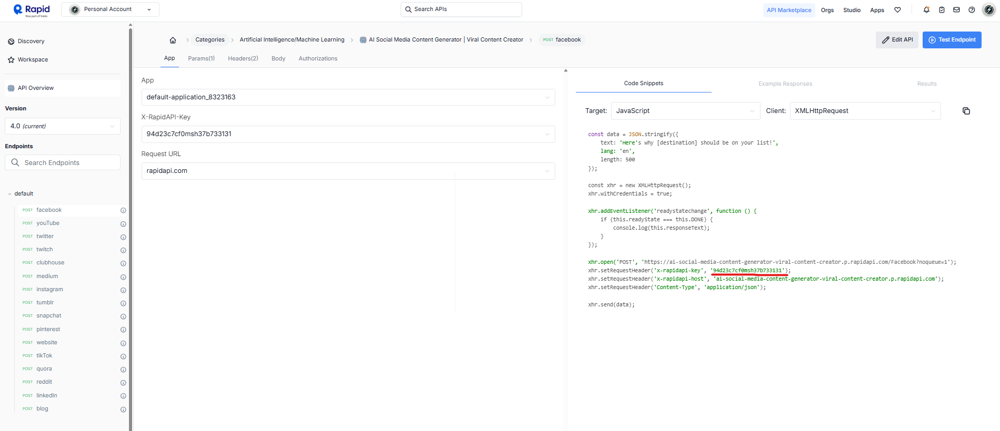
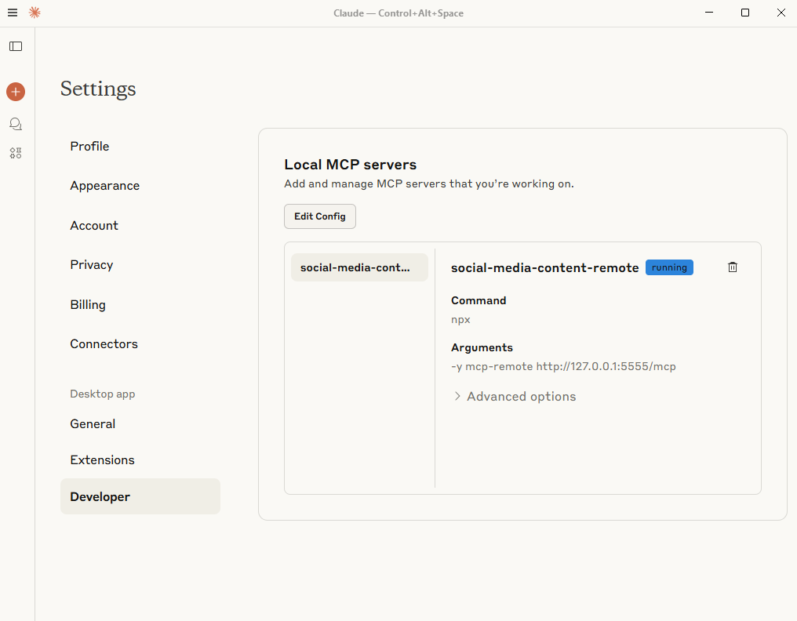
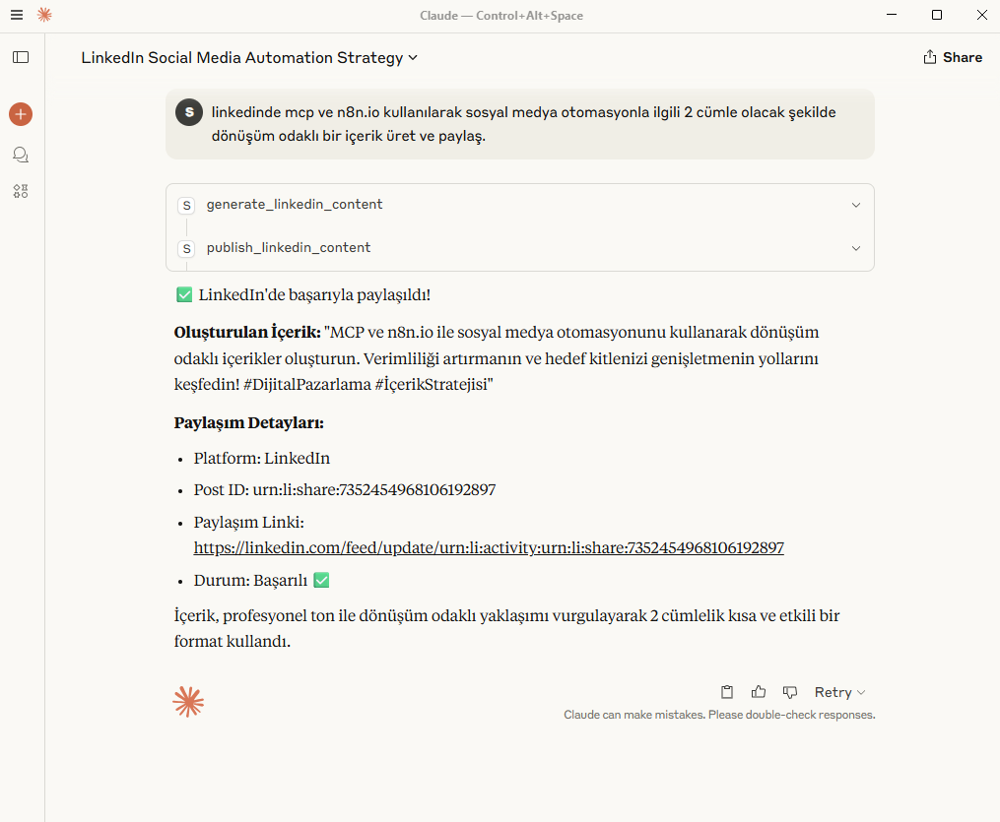
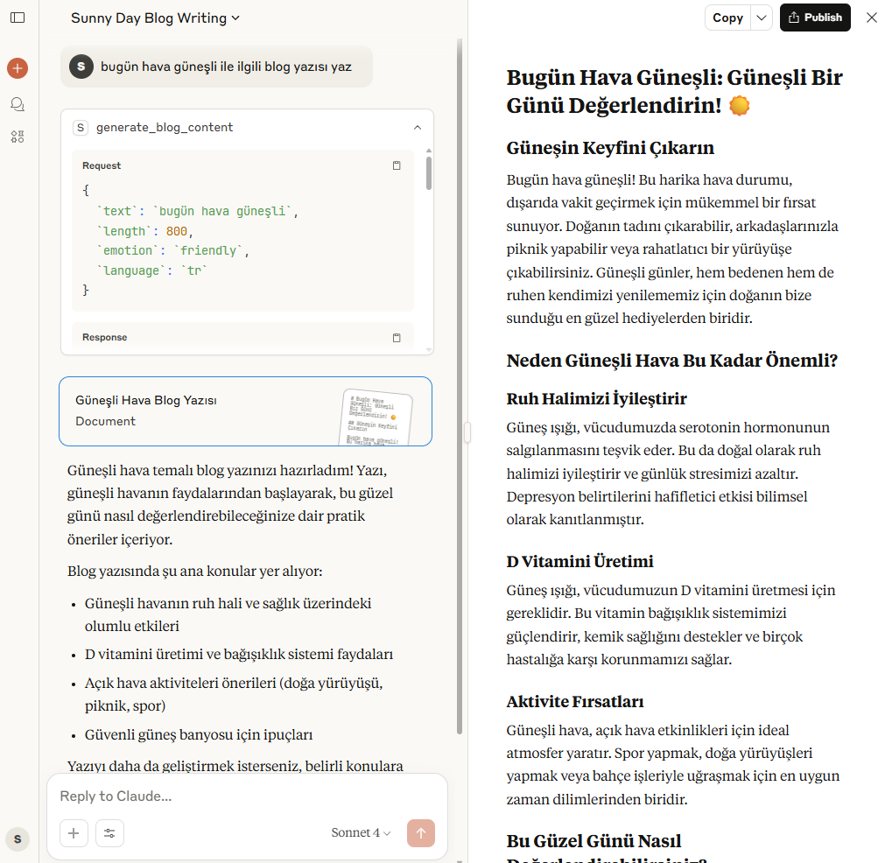
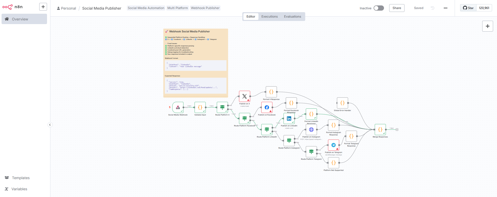
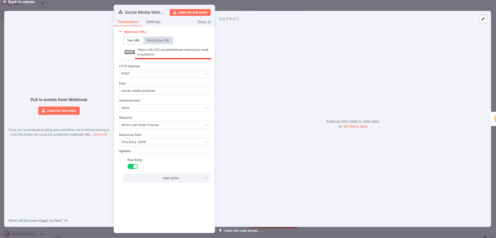

# 🚀 MCP Social Media Content Generator & Publisher

A powerful MCP (Model Context Protocol) server that generates optimized social media content using RapidAPI and publishes to multiple platforms via n8n workflows.

## 📋 Features

### Content Generation
- **Multi-Platform Support**: Instagram, Twitter/X, LinkedIn, Facebook, TikTok, Pinterest, YouTube, Blog, Reddit, Medium
- **AI-Powered Content**: Uses RapidAPI's AI Social Media Content Generator
- **Smart Optimization**: Platform-specific content length and style optimization
- **Emotion Detection**: Automatic sentiment analysis and emotion-based content enhancement
- **Multi-Language**: Support for multiple languages (EN, TR, ES, FR, DE, IT, PT, RU, JA, KO, ZH, AR)

### Publishing Integration
- **N8N Workflow**: Automated publishing to X, Facebook, LinkedIn, Instagram, Telegram
- **Webhook-Based**: Real-time publishing via n8n webhook integration
- **Error Handling**: Comprehensive error handling and response formatting
- **Multi-Platform Routing**: Sequential platform routing with proper response handling

## 🛠️ Installation & Setup

### 1. Install Dependencies

```bash
npm install
```

### 2. Environment Configuration

Copy the environment template and configure your API keys:

```bash
cp env.example .env
```

Edit `.env` file:
```env
# RapidAPI Configuration
API_HOST=https://ai-social-media-content-generator-viral-content-creator.p.rapidapi.com
RAPIDAPI_KEY=your_rapidapi_key_here

# N8N Webhook Configuration  
N8N_WEBHOOK_URL=your_n8n_webhook_url_here

# MCP Server Configuration
MCP_PORT=5555
```

### 3. Get RapidAPI Key



1. Visit [RapidAPI Social Media Content Generator](https://rapidapi.com/ltdbilgisam/api/ai-social-media-content-generator-viral-content-creator)
2. Subscribe to the API
3. Copy your RapidAPI key to `.env` file

### 4. MCP Server Setup in Claude



Add the server configuration to your Claude Desktop config:

```json
{
  "mcpServers": {
    "social-media-content-remote": {
      "command": "npx",
      "args": ["-y", "mcp-remote", "http://127.0.0.1:5555/mcp"]
    }
  }
}
```

## 🚀 Running the MCP Server

### Production Mode (Default)
```bash
npm start
```

### Development Mode with Inspector
```bash
npm run dev
```

## 🤖 Using MCP Server in Claude





Once the MCP server is running and configured in Claude Desktop, you can use it with natural language commands:

### Content Generation Examples:

```
Generate LinkedIn content: "MCP ve n8n.io kullanarak sosyal medya otomasyonu"
```

```
Create Instagram post: "New AI automation workflow launched!"
```

```
Generate Twitter content with custom parameters:
- Text: "Exciting AI developments"
- Emotion: excited
- Language: en
- Length: 200
```

### Available MCP Tools:

- `generate_[platform]_content` - Generate content for specific platforms
- `list_supported_platforms` - View all supported platforms
- `list_available_emotions` - See available emotional tones
- `publish_[platform]_content` - Publish content via n8n webhook

## 📡 N8N Workflow Integration

### N8N Workflow Setup



1. Import the provided workflow file: `Social_Media_Publisher.n8n.workflow.json`
2. Configure platform credentials (Twitter, Facebook, LinkedIn, Instagram, Telegram)
3. Set up webhook URL



### Hosting N8N Workflow

For reliable n8n workflow hosting, you can use:
🌐 **[Hostinger VPS](https://hostinger.com.tr?REFERRALCODE=W7XSMTK832)** - Get a VPS with this referral link for hosting your n8n instance.

### Workflow Features:

- **Sequential Platform Routing**: X → Facebook → LinkedIn → Instagram → Telegram
- **Platform-Specific Response Parsing**: Proper handling of each platform's API response
- **Error Handling**: Comprehensive error catching and user-friendly responses
- **Content Validation**: Platform-specific content length and format validation
- **Real-time Publishing**: Instant publishing via webhook triggers

### Webhook Request Format:

```json
{
  "platform": "linkedin",
  "content": "Your social media content here",
  "imageUrl": "https://example.com/image.jpg" // optional
}
```

### Response Format:

```json
{
  "success": true,
  "platform": "linkedin", 
  "message": "Successfully published on LinkedIn",
  "postId": "urn:li:activity:123456789",
  "postUrl": "https://linkedin.com/feed/update/urn:li:activity:123456789",
  "timestamp": "2024-01-01T12:00:00.000Z"
}
```

## 🔧 How It Works

### MCP Server Architecture:

1. **Content Generation**: Receives requests from Claude via MCP protocol
2. **API Integration**: Calls RapidAPI's AI content generator with platform-specific parameters
3. **Response Processing**: Formats and optimizes content for target platform
4. **Publishing Bridge**: Sends content to n8n webhook for social media publishing

### N8N Workflow Process:

1. **Webhook Trigger**: Receives publishing request from MCP server
2. **Input Validation**: Validates platform and content format
3. **Platform Routing**: Routes to appropriate social media platform
4. **Content Publishing**: Publishes content using platform-specific APIs
5. **Response Formatting**: Returns standardized success/error responses

## 📱 Supported Platforms

### Content Generation:
- Instagram, Twitter/X, LinkedIn, Facebook, TikTok, Pinterest, YouTube, Blog, Reddit, Medium

### Publishing Platforms:
- X (Twitter), Facebook, LinkedIn, Instagram, Telegram

## 🌍 Multi-Language Support

- English (en), Turkish (tr), Spanish (es), French (fr), German (de)
- Italian (it), Portuguese (pt), Russian (ru), Japanese (ja), Korean (ko)
- Chinese (zh), Arabic (ar)

## 🎭 Emotion & Tone Options

- **excited**: energetic, enthusiastic, passionate
- **professional**: formal, authoritative, trustworthy  
- **friendly**: warm, approachable, conversational
- **inspiring**: motivational, uplifting, encouraging
- **informative**: educational, clear, factual
- **humorous**: funny, witty, entertaining
- **nostalgic**: nostalgic, thoughtful, emotional
- **urgent**: urgent, pressing, action-oriented
- **casual**: relaxed, informal, laid-back
- **grateful**: thankful, appreciative, heartfelt
